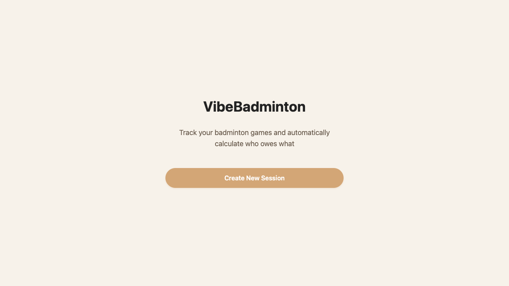
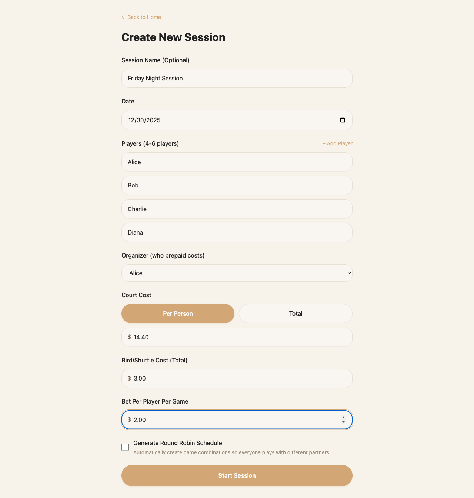
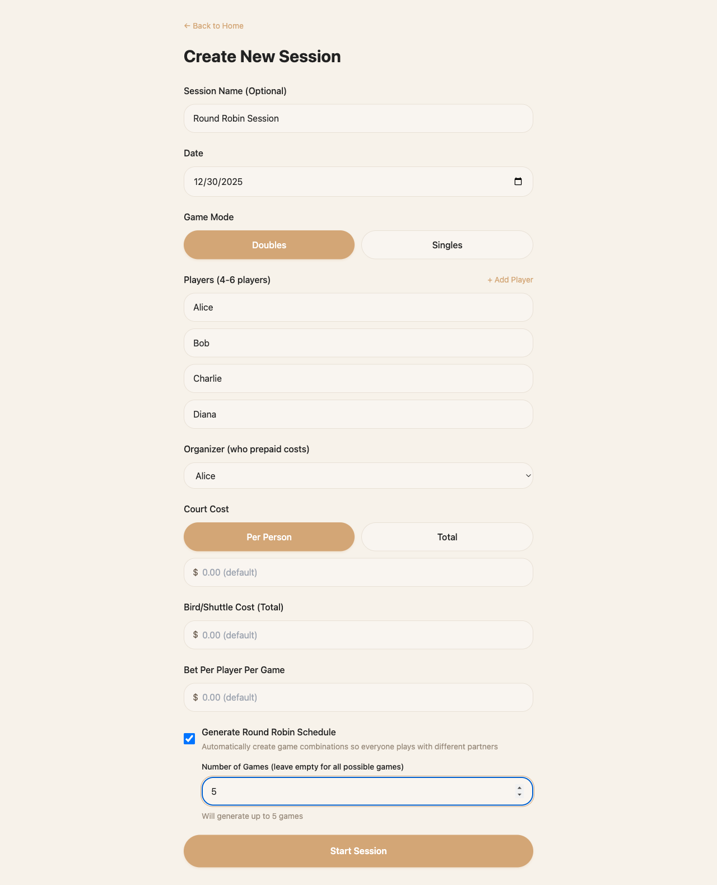
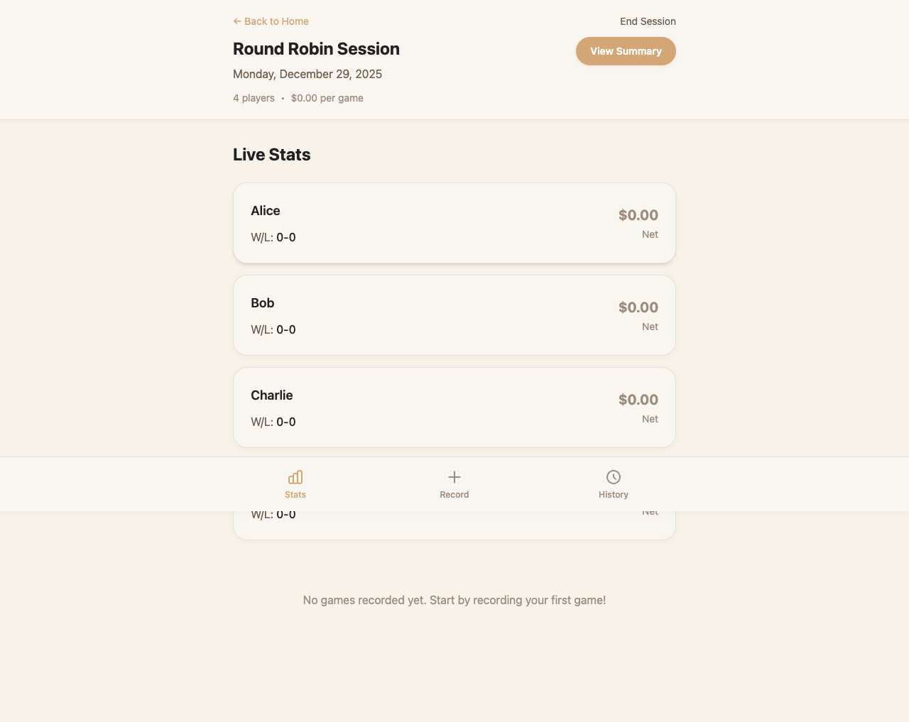
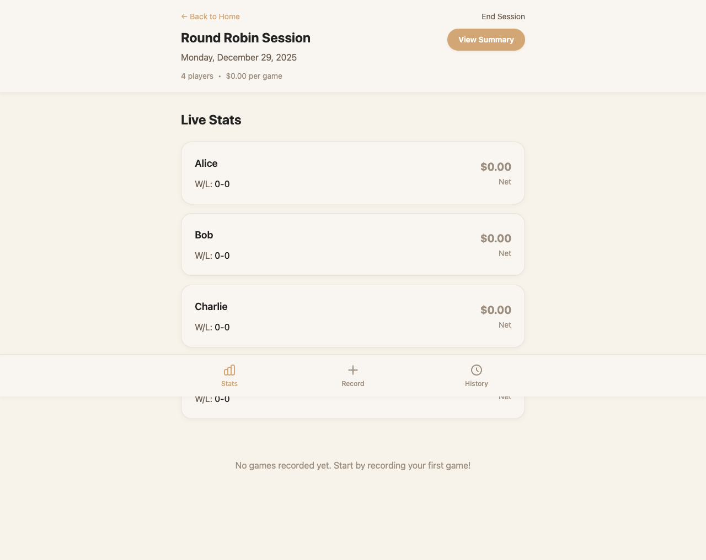
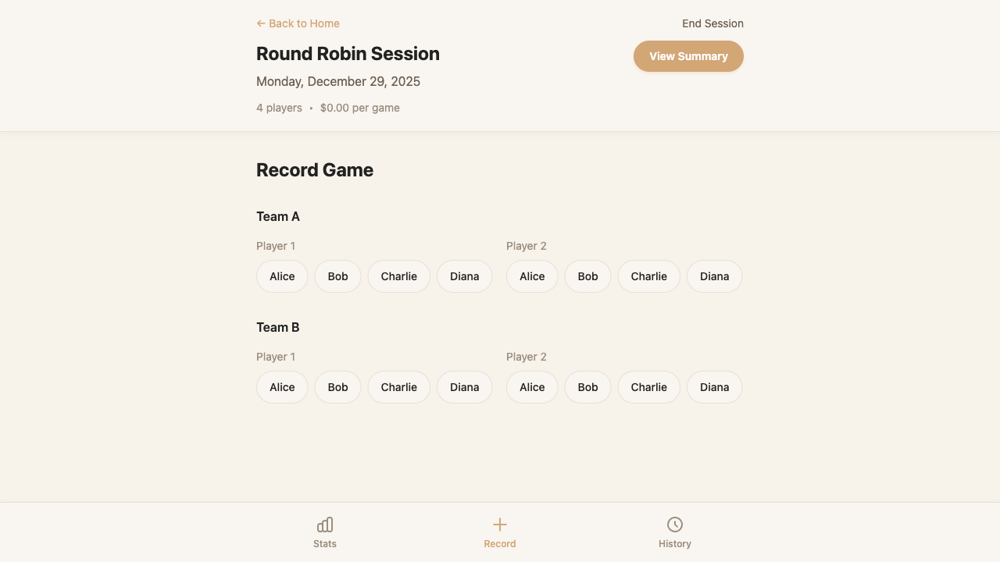
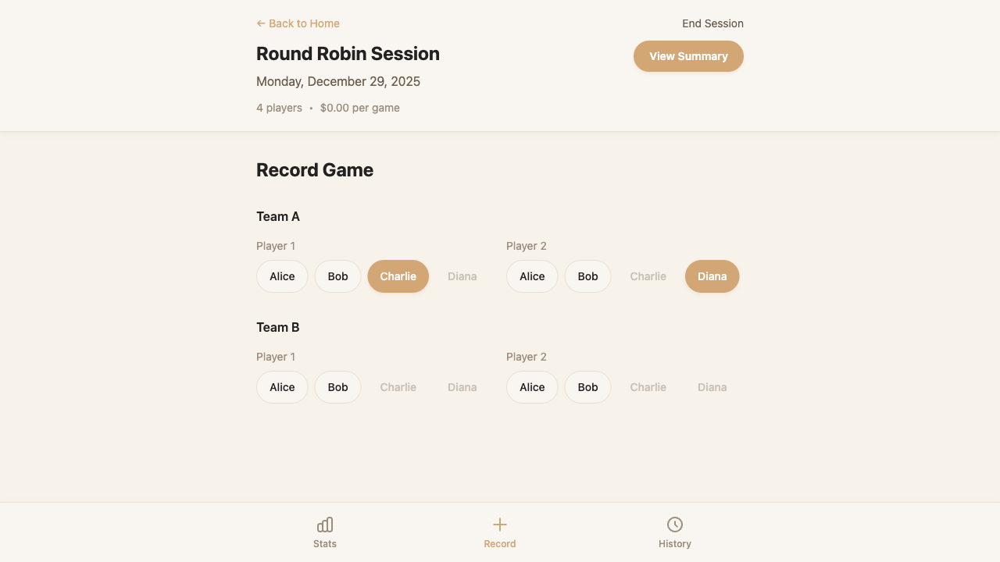
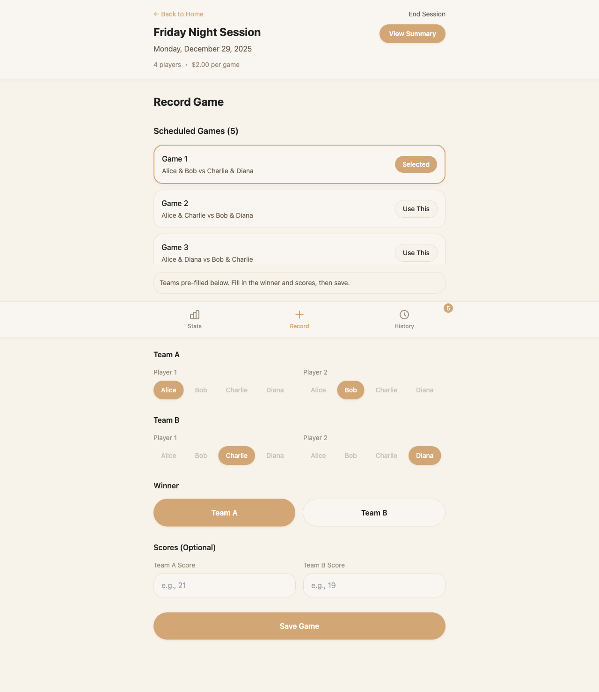
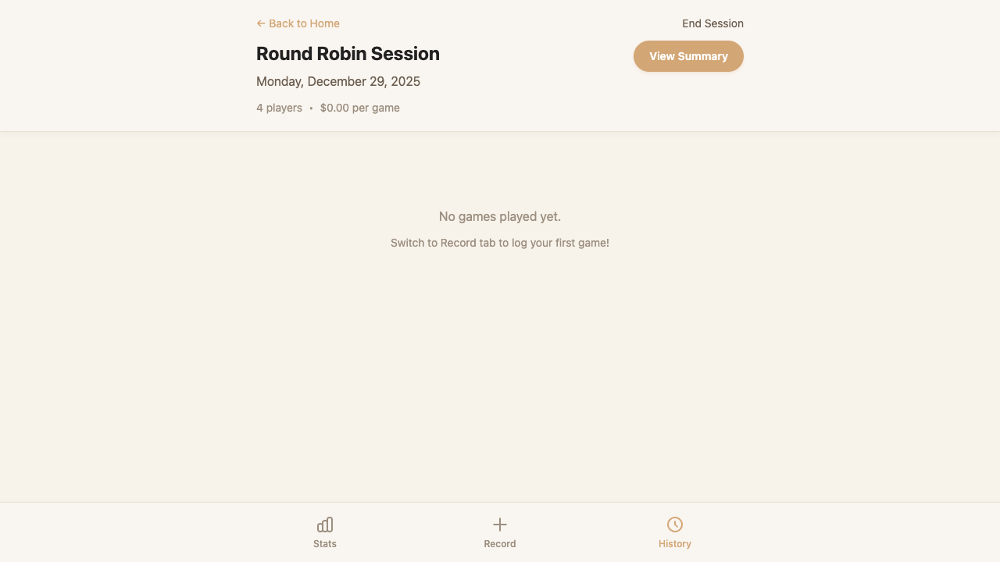
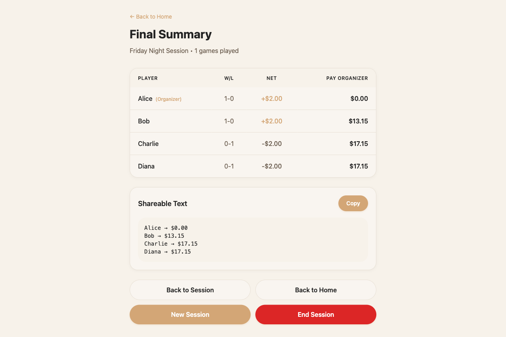

# VibeBadminton

A tiny web app that helps groups of friends track their badminton games (doubles or singles) during a session and automatically calculates wins/losses, gambling results, shared costs, and final "who owes who how much" at the end of the night.

## Features

- **Create Sessions**: Set up a badminton session with players and financial settings
- **Game Modes**: Support for both doubles (4-6 players) and singles (2-6 players) gameplay
- **Round Robin Scheduling**: Generate scheduled game combinations with customizable count
- **Log Games**: Quickly log games during play (select teams/players, mark winner, or use scheduled games)
- **Live Stats**: Real-time win/loss tracking and gambling net calculations
- **Game Planning**: See upcoming scheduled games to plan your session time
- **Auto-Calculate**: Automatically calculates wins/losses, gambling net, and final settlement
- **Multiple Sessions**: Create and manage multiple sessions, switch between them easily
- **Mobile-First**: Designed for use at the court with optimized mobile navigation

## Screenshots

All screenshots are captured from automated testing and located in `docs/screenshots/test-results/`.

### Home Page

*Welcome page with active session card and create session button*

### Create Session

*Empty session creation form*


*Session creation form with player inputs, financial settings, and organizer selection*


*Session creation form with round robin scheduling enabled*

### Session Page - Stats Tab

*Stats tab with no games recorded yet*


*Live stats showing wins/losses and gambling net for each player*

### Session Page - Record Tab

*Empty game entry form*


*Game entry form with teams selected*


*Game entry form ready to save with winner selected*

### Session Page - History Tab

*Complete game history with undo functionality*

### Summary Page

*Final settlement table with shareable text for easy distribution*

See [docs/screenshots/test-results/README.md](docs/screenshots/test-results/README.md) for more details.

## Tech Stack

- **Framework**: Next.js 14 (App Router)
- **Language**: TypeScript
- **Styling**: Tailwind CSS
- **State**: React useState/useContext (in-memory for MVP)

## Getting Started

### Prerequisites

- Node.js 18+ and npm

### Installation

1. Install dependencies:
```bash
npm install
```

2. Run the development server:
```bash
npm run dev
```

3. Open [http://localhost:3000](http://localhost:3000) in your browser

## Project Structure

```
VibeBadminton/
├── app/                    # Next.js app directory
│   ├── page.tsx           # Home page
│   ├── create-session/    # Create session page
│   └── ...
├── docs/                   # Documentation
│   ├── vision/            # Product vision
│   ├── mvp/               # MVP specifications
│   ├── process/           # Dev plans, progress logs
│   ├── engineering/       # Technical documentation
│   └── prompts/           # AI agent prompts
├── types/                 # TypeScript type definitions
└── ...
```

## Documentation

**📖 Start here**: **[docs/README.md](docs/README.md)** - Complete guide covering everything you need to know.

**Quick Reference**:
- [MVP Specification](docs/reference/mvp/mvp_spec.md) - Detailed requirements
- [Testing Checklist](docs/TESTING_CHECKLIST.md) - Test guide

All documentation is organized for easy navigation. The main README has everything essential; detailed reference docs are in `docs/reference/` and `docs/_archive/`.

## Development

### Using AI Agents

This project uses specialized AI agents for different tasks:

- **PM Agent**: "PM agent, update the docs based on what we just did"
- **QA Agent**: "QA agent: design tests for [feature]"
- **Engineer Agent**: "Engineer agent: implement [feature]"

See `docs/prompts/USAGE_GUIDE.md` for more details.

## MVP Scope

The MVP focuses on:
- Creating a session with players and financial settings
- Logging games during the session
- Automatically calculating final money settlement

**Out of scope for MVP:**
- User authentication
- Persistence across sessions
- Elo ratings
- Multi-session history

## License

MIT

